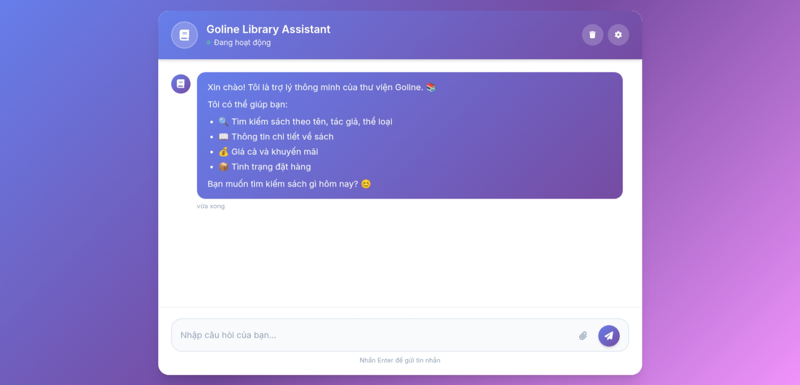

# Goline Library Chatbot

Hệ thống chatbot thông minh hỗ trợ quản lý và tương tác với thư viện Goline, cung cấp khả năng tìm kiếm sách, trả lời câu hỏi và hỗ trợ người dùng một cách tự động.


## 🚀 Cài đặt

### Yêu cầu hệ thống

- Đã cài Docker

### Cài đặt dependencies
1. Clone github
```bash
# Clone repository
git clone https://github.com/longduongbao29/Goline_library_chatbot.git
cd Goline_library_chatbot

## Build images
sh build-all.sh


```
2. Tạo `.env` để config, xem file .env.example:
```env
OPENAI_API_KEY=your_openai_api_key
```
3. Chạy docker compose
docker compose up -d

4. Truy cập endpoint http://localhost:1235/ để truy cập demo ui


## 🏗️ Kiến trúc hệ thống

Goline_library_chatbot/
├── build-all.sh
├── chabot_ui
│   ├── Dockerfile
│   ├── index.html
│   ├── nginx.conf 
│   ├── scripts.js
│   └── style.css
├── chatbot_backend
│   ├── agent
│   ├── api
│   ├── config
│   ├── database
│   ├── Dockerfile
│   ├── llm
│   ├── logs
│   ├── main.py
│   ├── requirements.txt
│   ├── services
│   └── utils
├── docker-compose.yml
├── init.sql
└── README.md
```

## 🔧 API Documentation

### Endpoints chính
Truy cập http://localhost:1234/docs để xem docs của backend API

- `POST /api/v1/chat` - Gửi tin nhắn đến chatbot
- `POST /api/v1/orders/confirm` - Xác nhận mua hàng
